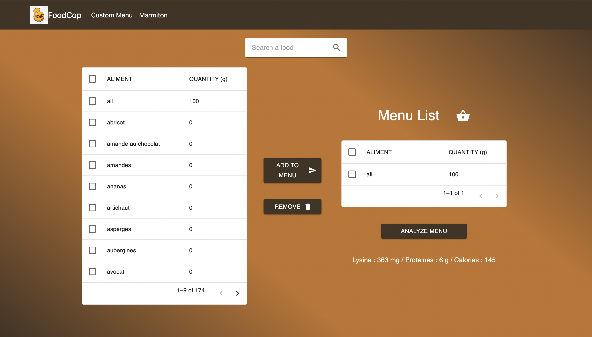

# Intakes calcul from a menu

This project aims to calcul multiple intakes from a food list.
It could be usefull for some diseases that restrict the diet of the sick person.

## Usage with Docker

- First create `.env` file :

```bash
mv .env.example .env
```

- Now you can fill your `.env` file with your postgres database values.

`Example :`

```bash
POSTGRES_USER="postgres"
POSTGRES_PASSWORD="postgres"
POSTGRES_DB="foodDB"
HOST="foodDB"
PORT="5432"

KC_DB="postgres"
KC_DB_URL="jdbc:postgresql://foodDB:5432/foodDB"
KC_DB_USERNAME="postgres"
KC_DB_PASSWORD="postgres"
KEYCLOAK_ADMIN="admin"
KEYCLOAK_ADMIN_PASSWORD="admin"
KC_DB_SCHEMA="public"
```

- Run docker :

```bash
docker compose build && docker compose up -d
```

Now, you can access UI at `http://localhost:8000` and backend run at `http://localhost:3000`.

## USAGE WITH BASH CMD

```bash
run.sh
```

## KEYCLOAK

For access Keycloak console admin, go to : `http://localhost:8080/admin/master/console/`.

## IHM

[](./front/public/demo.mov)
